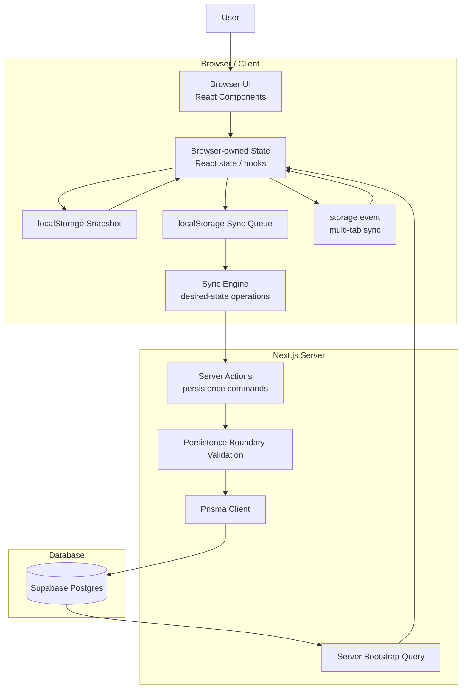

# ToDoster Architecture

## Project goal

ToDoster is a production-oriented learning pet project.

The goal is not only to build a todo application, but to learn:

- modern full-stack engineering
- production architecture thinking
- AI-assisted development workflows
- incremental product development

---

## Architectural direction

ToDoster uses a browser-first / local-first sync architecture.

Core principles:

- browser owns live interactive application state
- server owns persistence and trust-boundary validation
- database is durable persisted truth
- browser state is optimized for responsiveness
- persistence is optimized for durability and cross-browser consistency

This is an intentional pivot away from the earlier server-first / revalidation-driven architecture.

---

## System architecture overview



---

## Core architectural rules

### Browser state ownership

Browser state is the live source of truth for interactive UI.

This means:

- user interactions update browser state immediately
- rendering is driven by browser state
- UI responsiveness does not depend on server round-trips

The server does not own live UI state.

---

## Session model

The architecture distinguishes between:

- active browser session
- new browser session

Implementation intent:

- `sessionStorage` tracks whether the current browser session is active
- `localStorage` stores browser snapshot and sync queue

Rules:

If browser session is active:

- restore browser-owned snapshot

If browser session is new:

- fetch latest persisted state from the server
- initialize browser state from server bootstrap
- overwrite local browser snapshot
- mark browser session as active

This protects both:

- in-session continuity
- cross-browser consistency

---

## Startup bootstrap rule

Bootstrap behavior depends on browser session context.

### Active browser session

Browser snapshot is authoritative.

Examples:

- page refresh
- route navigation
- accidental reload
- tab continuation

Flow:

```txt
reload
→ restore browser snapshot
→ continue browser-owned state
```

Purpose:

Prevent local work from being lost before persistence completes.

---

### New browser session

Server bootstrap is authoritative.

Flow:

```txt
new browser session
→ fetch latest persisted database state
→ initialize browser state
→ write fresh browser snapshot
→ mark session active
```

Reason:

A stale snapshot from an earlier session must not silently override newer persisted database truth.

Example:

Bad:

```txt
Browser A updates todos
→ persists to DB

Later:

Browser B has stale local snapshot
→ opens app
→ stale snapshot overrides persisted truth
```

Good:

```txt
Browser A updates todos
→ persists to DB

Later:

New browser session starts
→ latest DB snapshot loads
→ browser initializes from durable truth
```

---

## Local-first interaction rule

After initialization:

- browser updates happen immediately
- persistence happens asynchronously

Flow:

```txt
user action
→ browser validation
→ browser state update
→ local snapshot update
→ sync queue append
→ persistence dispatch
→ server validation
→ database persistence
```

---

## Validation model

Validation exists in two layers.

### Browser validation

Browser validation protects browser-owned domain state.

Invalid state should not enter live browser state.

Examples:

- empty titles
- whitespace-only titles
- malformed values
- invalid edit inputs

Purpose:

Protect UX consistency and domain correctness.

---

### Server validation

Server validation protects the persistence trust boundary.

Server must re-validate all persistence operations.

Reasons:

- browser bugs
- stale frontend code
- corrupted browser storage
- manual requests
- future authorization / permissions

Server validation is defensive trust-boundary validation.

It is not the primary UX validation layer.

---

## Persistence model

Three truth layers exist.

### Browser interactive truth

Browser state is live interactive truth.

Properties:

- immediate
- responsive
- optimistic
- mutable

---

### Browser session persistence

Browser snapshot persistence protects session continuity.

Used for:

- refresh recovery
- reload recovery
- tab continuity
- multi-tab coordination

Not authoritative across sessions.

---

### Durable persisted truth

Database state is durable shared truth.

Properties:

- persistent
- cross-browser
- cross-device
- authoritative for new browser sessions

---

## Sync model

Synchronization uses desired-state operations.

Good:

```ts
{
  type: "setTodoDone",
  todoId: "todo_123",
  isDone: true
}
```

Bad:

```ts
{
  type: "toggleTodo",
  todoId: "todo_123"
}
```

Desired-state operations are preferred because they are:

- deterministic
- retry-friendly
- easier to reason about
- better for conflict handling

---

## Conflict strategy

Current conflict strategy:

Last Write Wins (LWW)

Reason:

Keep architecture simple while learning browser-first sync design.

Not introduced yet:

- merge strategies
- CRDTs
- operational transforms
- collaborative conflict resolution

---

## Multi-tab behavior

Tabs within the same browser profile coordinate through:

- `localStorage`
- `storage` event

This enables:

- snapshot propagation
- sync queue propagation
- in-session state continuity

This is browser-local coordination.

Not realtime backend sync.

---

## Server Actions role

Server Actions are persistence commands.

Allowed responsibilities:

- validate persistence payloads
- enforce current user scope
- persist through Prisma
- return persistence results if needed

Forbidden responsibilities:

- driving interactive UI state
- browser-first revalidation orchestration
- `revalidatePath` for browser interactions
- toggle-style mutation semantics

---

## Temporary assumptions

Authentication does not exist yet.

Temporary user:

```ts
export const TEMP_USER_ID = "test-user";
```

All reads and writes are scoped to this temporary identity.

---

## Current stack

- Next.js App Router
- React 19
- TypeScript
- Tailwind CSS
- Prisma 7
- Supabase Postgres
- Server Actions
- localStorage
- sessionStorage

---

## Explicitly out of scope

Do NOT introduce yet:

- authentication
- IndexedDB
- service workers
- global state libraries
- cache libraries
- realtime sync
- collaborative editing
- zod
- drag-and-drop

---

## Development workflow

Required process:

```txt
define → design → implement → review → build → commit
```

Mandatory after every implementation:

```bash
npm run build
```