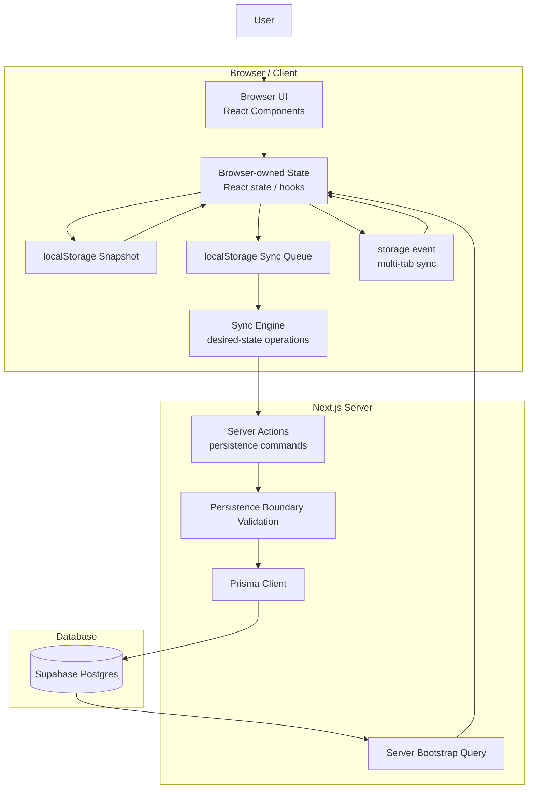

# ToDoster Architecture

## Project goal

ToDoster is a production-oriented learning pet project.

The goal is not only to build a todo application, but to learn:

- modern full-stack engineering
- production architecture thinking
- AI-assisted development workflows
- incremental product development

---

## Architectural direction

ToDoster uses a browser-first / local-first sync architecture.

Core principles:

- browser owns live interactive application state
- server owns persistence and trust-boundary validation
- database is durable persisted truth
- browser state is optimized for responsiveness
- persistence is optimized for durability and cross-browser consistency

This is an intentional pivot away from the earlier server-first / revalidation-driven architecture.

---

## System architecture overview



---

## Core architectural rules

### Browser state ownership

Browser state is the live source of truth for interactive UI.

This means:

- user interactions update browser state immediately
- rendering is driven by browser state
- UI responsiveness does not depend on server round-trips

The server does not own live UI state.

---

## Session model

The architecture distinguishes between:

- active browser-profile session window
- expired or missing browser-profile session window

Implementation intent:

- `localStorage` stores browser snapshot
- `localStorage` stores sync queue
- `localStorage` stores a shared browser-profile session marker
- the session marker uses TTL semantics
- the marker contains:
  - `startedAt`
  - `lastSeenAt`

Rules:

If a valid non-expired session marker exists:

- restore browser-owned snapshot
- continue local browser state
- update `lastSeenAt`

If the marker is missing or expired:

- fetch latest persisted server state
- initialize browser state from server bootstrap
- overwrite local browser snapshot
- create a fresh session marker

This is a pragmatic browser-profile continuity model, not a perfect browser lifecycle signal.

---

## Startup bootstrap rule

Bootstrap behavior depends on session window state.

### Active browser-profile session window

Browser snapshot is authoritative.

Examples:

- page refresh
- route navigation
- accidental reload
- opening a new tab shortly after using the app

Flow:

```txt
reload / reopen soon
→ restore browser snapshot
→ continue browser-owned state
```

Purpose:

Prevent local work from being lost before persistence completes.

---

### Missing or expired browser-profile session window

Server bootstrap is authoritative.

Flow:

```txt
open app after session expiry
→ fetch latest persisted database state
→ initialize browser state
→ overwrite browser snapshot
→ create fresh session marker
```

TTL behavior:

- refresh shortly after local work restores browser snapshot
- new tabs shortly after local work restore browser snapshot
- reopening the app much later starts from server bootstrap

Reason:

A stale snapshot from an older browser context must not silently override newer persisted truth.

---

## Local-first interaction rule

After initialization:

- browser updates happen immediately
- persistence happens asynchronously

Flow:

```txt
user action
→ browser validation
→ browser state update
→ local snapshot update
→ sync queue append
→ persistence dispatch
→ server validation
→ database persistence
```

---

## Validation model

Validation exists in two layers.

### Browser validation

Browser validation protects browser-owned domain state.

Invalid state should not enter live browser state.

Examples:

- empty titles
- whitespace-only titles
- malformed values
- invalid edit inputs

Purpose:

Protect UX consistency and domain correctness.

---

### Server validation

Server validation protects the persistence trust boundary.

Server must re-validate all persistence operations.

Reasons:

- browser bugs
- stale frontend code
- corrupted browser storage
- manual requests
- future authorization / permissions

Server validation is defensive trust-boundary validation.

It is not the primary UX validation layer.

---

## Persistence model

Three truth layers exist.

### Browser interactive truth

Browser state is live interactive truth.

Properties:

- immediate
- responsive
- optimistic
- mutable

---

### Browser continuity persistence

Browser snapshot persistence protects continuity.

Used for:

- refresh recovery
- reload recovery
- short-term tab continuity
- multi-tab coordination

Not authoritative long-term.

---

### Durable persisted truth

Database state is durable shared truth.

Properties:

- persistent
- cross-browser
- cross-device
- authoritative after session expiry

---

## Sync model

Synchronization uses desired-state operations.

Good:

```ts
{
  type: "setTodoDone",
  todoId: "todo_123",
  isDone: true
}
```

Bad:

```ts
{
  type: "toggleTodo",
  todoId: "todo_123"
}
```

Desired-state operations are preferred because they are:

- deterministic
- retry-friendly
- easier to reason about
- better for conflict handling

---

## Conflict strategy

Current conflict strategy:

Last Write Wins (LWW)

Reason:

Keep architecture simple while learning browser-first sync design.

Not introduced yet:

- merge strategies
- CRDTs
- operational transforms
- collaborative conflict resolution

---

## Todo feature scope before auth

Allowed remaining todo features before authentication:

- uncheck all
- trash and permanent delete
- drag-and-drop reorder

Drag-and-drop is allowed only for reordering existing todo lists and existing todo items within their current list.

No cross-list item moves yet.

After uncheck all, trash/permanent delete, and drag-and-drop reorder are complete, do not add new todo features before authentication. Project focus moves to authentication, then UI polish.

---

## Multi-tab behavior

Tabs within the same browser profile coordinate through:

- `localStorage`
- `storage` event

This enables:

- snapshot propagation
- sync queue propagation
- short-term continuity

This is browser-local coordination.

Not realtime backend sync.

---

## Server Actions role

Server Actions are persistence commands.

Allowed responsibilities:

- validate persistence payloads
- enforce current user scope
- persist through Prisma
- return persistence results if needed

Forbidden responsibilities:

- driving interactive UI state
- browser-first revalidation orchestration
- `revalidatePath` for browser interactions
- toggle-style mutation semantics

---


Authentication was already implemented.


## Current stack

- Next.js App Router
- React 19
- TypeScript
- Tailwind CSS
- Prisma 7
- Supabase Postgres
- Server Actions
- localStorage

---

## Explicitly out of scope

Do NOT introduce yet:

- authentication
- IndexedDB
- service workers
- global state libraries
- cache libraries
- realtime sync
- collaborative editing
- zod

---

## Development workflow

Required process:

```txt
define → design → implement → review → build → commit
```

Mandatory after every implementation:

```bash
npm run build
```
