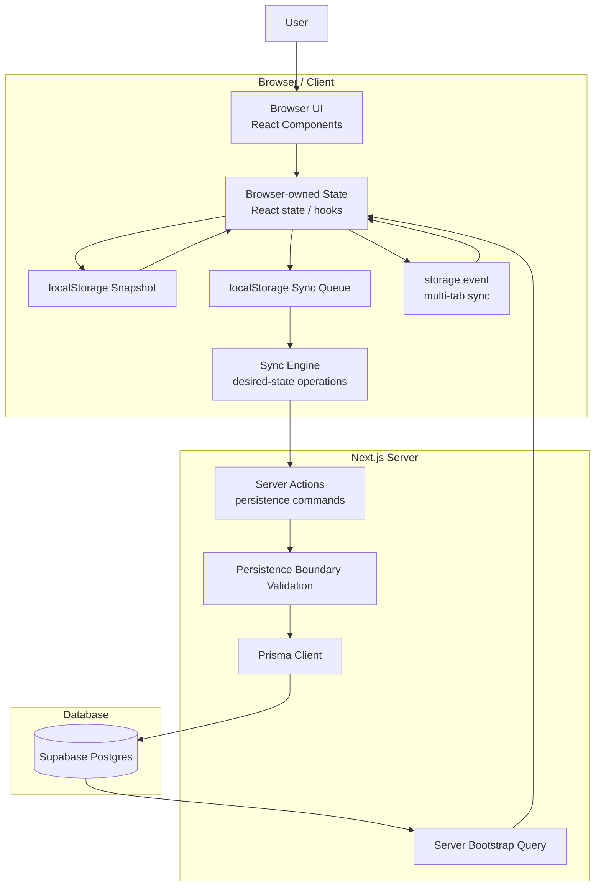

# ToDoster Architecture

## Project goal

ToDoster is a production-oriented learning pet project.

The goal is not only to build a todo application, but to learn modern full-stack engineering, architecture, and AI-assisted development workflows.

---

## Architectural direction

ToDoster uses a browser-first / local-first sync architecture.

Core principle:

- the browser owns live interactive application state;
- the server owns persistence and validation;
- the database is the durable source of persisted truth;
- local browser state is optimized for responsiveness;
- server state is optimized for durability.

This is an intentional pivot away from the earlier server-first / revalidate-driven model.

---

## System architecture overview



---

## Core architectural rules

### Browser state ownership

Browser state is the live source of truth for interactive UI.

This means:

- clicks update browser state immediately;
- browser state drives rendering;
- UI responsiveness does not depend on round-trips.

The server does not own live UI state.

---

### Startup bootstrap rule

On every new application startup:

- the server bootstrap is the authoritative initial seed;
- the browser initializes state from the latest persisted database snapshot;
- that snapshot is then written to localStorage.

Important:

localStorage must NOT override server bootstrap on startup.

Reason:

A stale snapshot from another browser session, browser profile, or older device must not overwrite newer persisted data.

Example:

Bad:

```txt
Browser A updates todos
→ syncs to database

Browser B has stale localStorage
→ opens app
→ stale localStorage overrides bootstrap
→ stale data gets re-persisted
```

Good:

```txt
Browser A updates todos
→ syncs to database

Browser B opens app
→ loads latest database snapshot
→ initializes browser state
→ writes fresh snapshot to localStorage
```

After startup initialization, browser state becomes authoritative for live interaction.

---

### Local-first interaction rule

After bootstrap:

- browser updates happen immediately;
- persistence happens asynchronously.

Flow:

```txt
User action
→ browser validation
→ browser state update
→ localStorage snapshot update
→ sync queue append
→ sync engine dispatch
→ server validation
→ database persistence
```

---

## Validation model

Validation exists in two places.

### Browser validation

Browser validation protects browser-owned domain state.

The browser should prevent invalid domain state from entering live UI state.

Examples:

- empty todo title;
- excessively long input;
- malformed edit state.

This protects UX consistency.

---

### Server validation

Server validation protects the persistence boundary.

The server must re-validate incoming sync operations because the client cannot be trusted.

Reasons:

- browser bugs;
- stale frontend code;
- corrupted localStorage;
- manually crafted requests;
- future auth / permission checks.

Server validation is not the first line of normal user validation.

---

## Persistence model

Database persistence is durable truth.

Browser state is ephemeral interactive truth.

Meaning:

Browser:

- fast
- responsive
- temporary
- optimistic

Database:

- durable
- shared between browsers
- persistence boundary
- authoritative persisted state

---

## Sync model

Sync is based on desired-state operations.

Good:

```ts
{
  type: "setTodoDone",
  todoId: "todo_123",
  isDone: true
}
```

Bad:

```ts
{
  type: "toggleTodo",
  todoId: "todo_123"
}
```

Desired-state operations are safer because they are:

- idempotent-friendly;
- retry-safe;
- easier for conflict resolution;
- deterministic.

---

## Conflict strategy

Current conflict resolution strategy:

Last Write Wins (LWW)

Reason:

This keeps architecture simple while learning browser-first sync design.

Not introduced yet:

- CRDTs
- merge strategies
- operational transforms
- collaborative editing conflict resolution

---

## Multi-tab behavior

Tabs in the same browser profile synchronize via:

`storage` event

This allows:

- snapshot updates to propagate;
- queue updates to propagate.

This is NOT realtime backend sync.

It only coordinates tabs sharing the same browser storage.

---

## Server Actions role

Server Actions are persistence commands.

They may:

- validate payloads;
- enforce current user scope;
- persist data;
- return persistence results.

They must NOT:

- drive interactive UI state;
- use revalidatePath for browser-first interactions;
- own browser rendering flow;
- implement toggle-style mutation semantics.

---

## Current temporary assumptions

Authentication does not exist yet.

Temporary user:

```ts
export const TEMP_USER_ID = "test-user";
```

All reads and writes are scoped to this temporary identity.

---

## Current stack

- Next.js App Router
- React 19
- TypeScript
- Tailwind CSS
- Prisma 7
- Supabase Postgres
- Server Actions
- localStorage

---

## Explicitly out of scope for now

Do NOT introduce:

- authentication
- IndexedDB
- service workers
- global state libraries
- cache libraries
- realtime sync
- collaborative editing
- zod
- drag-and-drop

---

## Development workflow

Process:

```txt
define → design → implement → review → build → commit
```

Mandatory after every change:

```bash
npm run build
```